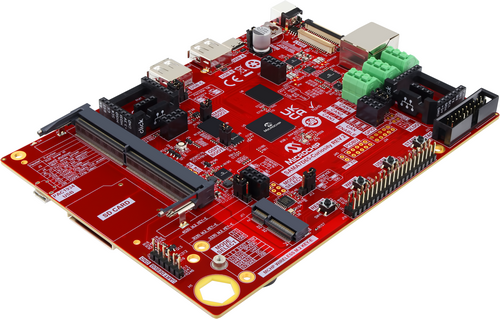

# Notice

The Early Access program for SAMA7D65 is now over.

The Early Access SAMA7D65 Curiosity kit (EA89C15A) has now been superseded by the production [SAMA7D65 Curiosity kit (EV63J76A)](https://www.microchip.com/en-us/development-tool/EV63J76A). 

We recommend referring to [SAMA7D65](https://www.microchip.com/en-us/product/SAMA7D65) and [SAMA7D65D2G](https://www.microchip.com/en-us/product/SAMA7D65D2G) product pages, and to the production [SAMA7D65 Curiosity kit](https://www.microchip.com/en-us/development-tool/EV63J76A) for the most up-to-date information.

# SAMA7D65 SoC/SiP Early Access - Collaterals
* Quick Start Guide
  * This kit comes with online Quick Start Guides allowing users to run a Linux or MPLAB Harmony v3 demo in less than 10 minutes.
  * Try it [here](https://developerhelp.microchip.com/xwiki/bin/view/software-tools/32-bit-kits/sama7d65-ea-curiosity/)!
* Hardware
  * Order the EA89C15A kit on [Microchip Direct](https://www.microchipdirect.com/dev-tools/EA89C15A)
  * Find the kit details on the [kit web page](https://www.microchip.com/en-us/development-tool/EA89C15A)
  * [Curiosity board Design Files](Hardware/)
  * [Curiosity Board User Guide](Hardware/)
  * **NOTE: A more recent production EV63J76A kit is available:** Order it on [Microchip Direct](https://www.microchipdirect.com/dev-tools/EV63J76A), and find all details, User Guide and Design Files on the [kit web page](https://www.microchip.com/en-us/development-tool/EV63J76A)
  * Both kits support the following Display Modules
    * [5.5" MIPI 720p LCD Display Module](https://www.microchip.com/en-us/development-tool/AC40T08A)
	* [5" WVGA LCD Display with LVDS interface and maXTouch](https://www.microchip.com/en-us/development-tool/AC69T88A)
	* Note: __The MIPI Display is in portrait-only mode, and the LVDS Display in landscape-only mode__
* Documentation
  * [SAMA7D6 Series Data Sheet](https://ww1.microchip.com/downloads/aemDocuments/documents/MPU32/ProductDocuments/DataSheets/SAMA7D6-Series-Data-Sheet-DS60001851.pdf)
  * [SAMA7D6 Series SiP Data Sheet](https://ww1.microchip.com/downloads/aemDocuments/documents/MPU32/ProductDocuments/DataSheets/SAMA7D6-Series-SiP-Data-Sheet-DS60001853.pdf)
  * [SAMA7D6 Series Silicon Errata and Data Sheet Clarifications](https://ww1.microchip.com/downloads/aemDocuments/documents/MPU32/ProductDocuments/Errata/SAMA7D6-Series-Silicon-Errata-and-Data-Sheet-Clarifications-DS80001131.pdf)
* Linux Software
  * [Linux Getting Started](https://www.linux4sam.org/bin/view/Linux4SAM/Sama7d65CuriosityMainPage)  (with links to Linux sources and demo images)
* MPLAB Harmony v3 Software
  * Find all code examples on [MPLAB Harmony github](https://github.com/microchip-mplab-harmony) or through [MPLAB Discover](https://mplab-discover.microchip.com/v2?dsl=com.microchip.ide.project%3Adevice.content.name%3Asama7d65&ds=%7B%22com.microchip.ide.project%22%3A%7B%22name%22%3A%22com.microchip.portal.start.displayCharacteristics%22%2C%22version%22%3A%221.6.0%22%7D%7D)
* Microchip Development Tools
  * [MPLAB X IDE](https://www.microchip.com/en-us/tools-resources/develop/mplab-x-ide)
  * [Device Family Pack (DFP)](https://packs.download.microchip.com/#collapse-Microchip-SAMA7D65-DFP-pdsc)
  * [SAM-BA in-system Programmer](https://www.microchip.com/en-us/development-tool/SAM-BA-IN-SYSTEM-PROGRAMMER)
  * [Microchip Programmers and Debuggers](https://www.microchip.com/en-us/tools-resources/debug/programmers-debuggers)
* Third-Party Development Tools
  * [Segger](https://www.segger.com/supported-devices/microchip/atsama7)
  * [Lauterbach](https://www.lauterbach.com/supported-platforms/chips/atsama7d65)

 

