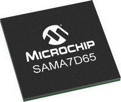

# SAMA7D65 Early Access - Repository

The SAMA7D6 Series is a high-performance Arm® Cortex®-A7 CPU-based embedded microprocessor (MPU) targeting HMI and connectivity applications in the home/building, industrial, appliance, medical & automotive markets.
The SAMA7D6 Series is delivered with a comprehensive development suite that includes a mainline Linux® distribution and the Microchip MPLAB® X/Harmony software framework.
Running at up to 1 GHz, the device offers support for multiple memories, such as 16-bit DDR2, DDR3, DDR3L, LPDDR2, LPDDR3, octal/quad SPI Flash. It integrates various display interfaces, including MIPI DSI®, LVDS and 8-bit Serial RGB.
The SAMA7D6 Series features connectivity options such as a dual 10/100/1000 Ethernet MAC with TSN support, five CAN-FD, three high-speed USB interfaces and embeds advanced security functions, such as PUF, secure boot, secure key storage and high-performance crypto accelerators for AES, SHA, RSA and ECC.

# SAMA7D65 Early Access - Collaterals
* Getting Started Demo - Out of Box Experience
  * This kit comes with an online Getting Started Demo allowing users to run a Linux or MPLAB Harmony v3 demo in less than 10 minutes. Try it [here](https://developerhelp.microchip.com/xwiki/bin/view/software-tools/32-bit-kits/sama7d65-ea-curiosity/)!
* Hardware
  * Order the kit on [Microchip Direct](https://www.microchipdirect.com/dev-tools/EA89C15A)
  * Find the kit details on the [kit web page](https://www.microchip.com/en-us/development-tool/EA89C15A)
  * [Curiosity board Design Files](Hardware/)
  * [Curiosity Board User Guide](Hardware/)
  * This Curiosity board supports the following Display Modules
    * [5.5" MIPI 720p LCD Display Module](https://www.microchip.com/en-us/development-tool/AC40T08A)
	* [5" WVGA LCD Display with LVDS interface and maXTouch](https://www.microchip.com/en-us/development-tool/AC69T88A)
* Documentation
  * [SAMA7D6 Preliminary Data Sheet](Documentation/)
  * [SAMA7D6 SiP Preliminary Data Sheet](Documentation/)
  * [SAMA7D6 Preliminary Errata and Data Sheet Clarifications](Documentation/)
* Linux Software
  * [Linux Getting Started](Linux/)  (with links to Linux sources and demo images)
* MPLAB Harmony v3 Software
  * [csp 3.19.0](https://github.com/Microchip-MPLAB-Harmony/csp) and [csp_apps_sama7d65 v3.0.0](https://github.com/Microchip-MPLAB-Harmony/csp_apps_sama7d65)
  * [core 3.13.4](https://github.com/Microchip-MPLAB-Harmony/core) and [core_apps_sama7d65 v3.0.0](https://github.com/Microchip-MPLAB-Harmony/core_apps_sama7d65)
  * [gfx 3.15.1](https://github.com/Microchip-MPLAB-Harmony/gfx) and [gfx_apps_sam_a7d65 v1.0.0](https://github.com/Microchip-MPLAB-Harmony/gfx_apps_sam_a7d65)
  * [bsp 3.20.0](https://github.com/Microchip-MPLAB-Harmony/bsp)
  * [net 3.12.0](https://github.com/Microchip-MPLAB-Harmony/net) and [net_apps_sama7d6 v1.0.0-E1](https://github.com/Microchip-MPLAB-Harmony/net_apps_sama7d6)
  * usb: coming soon
* Microchip Development Tools
  * [MPLAB X IDE](https://www.microchip.com/en-us/tools-resources/develop/mplab-x-ide)
  * [Device Family Pack (DFP)](https://packs.download.microchip.com/#collapse-Microchip-SAMA7D65-DFP-pdsc)
  * [SAM-BA in-system Programmer v3.8](https://www.microchip.com/en-us/development-tool/SAM-BA-IN-SYSTEM-PROGRAMMER)
  * [Microchip Programmers and Debuggers](https://www.microchip.com/en-us/tools-resources/debug/programmers-debuggers)
* Third-Party Development Tools
  * [Segger](https://www.segger.com/supported-devices/microchip/atsama7)
  * [Lauterbach](https://www.lauterbach.com/supported-platforms/chips/atsama7d65)

 

